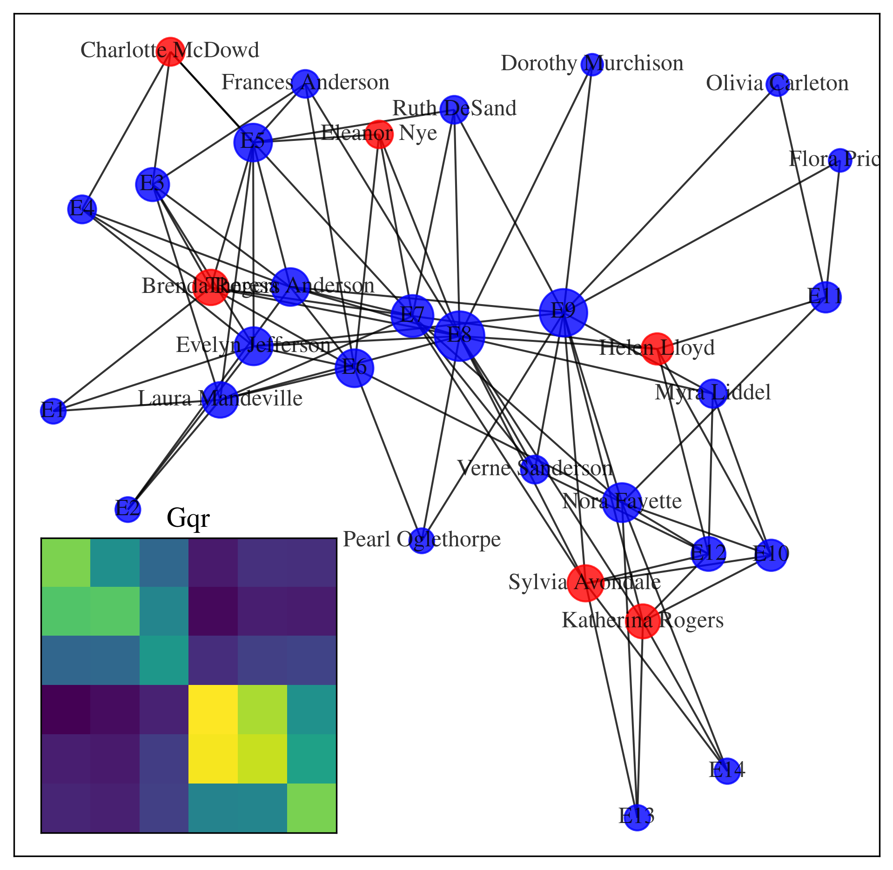

# PyGOMAX

Fast implementation of PageRank [1] and REGOMAX [2] for NetworkX graph library [3].

[1] Brin, S., & Page, L. (1998). The anatomy of a large-scale hypertextual web search engine.

[2] Frahm, K. M., Jaffrès-Runser, K., & Shepelyansky, D. L. (2016). Wikipedia mining of hidden links between political leaders. The European Physical Journal B, 89(12), 1-21.

[3] Hagberg, A., Swart, P., & S Chult, D. (2008). Exploring network structure, dynamics, and function using NetworkX (No. LA-UR-08-05495; LA-UR-08-5495). Los Alamos National Lab.(LANL), Los Alamos, NM (United States).

On a modern laptop, has been tested for networks4 mill of size up to 0.5 millions nodes and 4.5 millions links.

## Recquirements
* Numpy
* Networkx (tested with version 2.5)
* Eigen3 C++ library (header-only, provided if repo cloned in recursive mode)
* pybind11 (header-only, provided if repo cloned in recursive mode)

## Tutorial
Short example with Southern Woman graph:
```py
import numpy as np
import networkx as nx
from pygomax import pygomax

Graph = nx.davis_southern_women_graph()
Gmatrix = pygomax.GoogleMatrix(data=Graph.to_directed())

rnodes = ["Charlotte McDowd", "Brenda Rogers","Eleanor Nye", "Katherina Rogers", "Sylvia Avondale", "Helen Lloyd"]
Grr, Gpr, Gqr = pygomax.regomax(Gmatrix, rnodes)
```
Results can be visualized as 

<p align="center">

</p>

with the following code: 
```py
import matplotlib.pyplot as plt
from mpl_toolkits.axes_grid1.inset_locator import inset_axes

fig = plt.figure(figsize=(8,8))
ax = fig.add_subplot(111)

pos = nx.spring_layout(Graph, seed=42)
nx.draw_networkx(Graph,
                 pos=pos,
                 node_size = [pagerank*9000 for pagerank in pygomax.pagerank_cpp(Gmatrix).values()],
                 node_color = ["red" if node in rnodes else "blue" for node in Graph.nodes],
                 alpha=0.8)

axin = inset_axes(ax, width="35%", height="35%", loc=3, borderpad=1)
axin.set_xticks([])
axin.set_yticks([])
axin.set_title("Gqr")
axin.imshow(Gqr)
plt.show()
```
Gqr element being ordered top to bottom, left to right from rnodes. 

## Quick Start

PyGOMAX provide a Python interface of a C++ code. 

Building the C++ object is straighforward using CMake
```bash
mkdir build
cd build
cmake ..
make
```
The object appears in the same folder as the sources.
